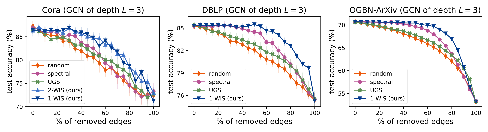

# On the Ability of Graph Neural Networks to Model Interactions Between Vertices
Code implementation for the experiments in [On the Ability of Graph Neural Networks to Model Interactions Between Vertices](https://arxiv.org/abs/2211.16494), based on the [PyTorch](https://pytorch.org/) and [PyTorch Geometric](https://pytorch-geometric.readthedocs.io/en/latest/) frameworks.

<br>
<p align="center">
  
</p>

## Walk Index Sparsification (WIS)
Implementations for the (L - 1)-WIS edge sparsification algorithm and its efficient 1-WIS variant, described by Algorithms 1 and 2 in the [paper](https://arxiv.org/abs/2211.16494), can be found at [```edges_removal/walk_index_sparsification.py```](edges_removal/walk_index_sparsification.py). 

> :ledger: A quickstart Jupyter Notebook for using 1-WIS can be found [here](wis_quickstart_example.ipynb).

<br>
<p align="center">
  
</p>

## Installing Requirements

Tested with python 3.8.
- Install PyTorch from the [official website](https://pytorch.org/) (tested with version 1.11.0), including ```torchvision```.
- Install PyTorch Geometric from the [official website](https://pytorch-geometric.readthedocs.io/en/latest/) (tested with version 2.0.4), including ```torch-sparse``` and ```torch-scatter```.
- The ```requirements.txt``` file includes additional requirements, which can be installed via:
```
pip install -r requirements.txt
```

For experiments with the OGBN-ArXiv dataset:
- Install the OGB library from the [official website](https://ogb.stanford.edu/).
- Install [Julia](https://julialang.org/) for running the spectral sparsification algorithm from [Spielman & Srivastava 2011](https://arxiv.org/abs/0803.0929) (tested with version 1.8.3).


## 1. Empirical Demonstration of Theoretical Analysis


### 1.1 Generating Data
```
python is_same_class_dataset_generator.py
```
- By default, the generated dataset will be placed at "data/gisc".
- Use the ```-h``` flag for information on the customizable run arguments.

### 1.2 Running Experiments
The following command reproduces the experiments reported in Table 1 of the [paper](https://arxiv.org/abs/2211.16494). Before running, make sure that the ```dataset_path``` field in the configuration file points to the dataset generated in the previous step.
```
python is_same_class_experiments_plan_runner.py --plan_config_path is_same_class/experiments_plans/is_same_class_experiments_plan.json
```
- A folder with log files and results of the experiments will be automatically created under the directory specified by ```outputs_dir``` in the configuration file.
- It is recommended to use a GPU by adding an available gpu id to the ```gpu_ids_pool``` field in the configuration file.
- See ```is_same_class/experiments_plans/is_same_class_experiments_plan.json``` for further configuration options, which are documented in ```common/experiment/fit_experiment_base.py``` and ```is_same_class/experiments/is_same_class_experiment.py```.

### 1.3 Printing Results
The following command prints the mean and standard deviation of accuracies for experiments ran in the previous step, per model, dataset, and learning rate.
```
python is_same_class_accuracy_printer.py --experiments_dir outputs/gisc
```
- The ```experiments_dir``` parameter specifies the directory in which the experiment results are located, determined by ```outputs_dir``` in the previous step (default folder is ```outputs/gisc```).

## 2. Edge Sparsification

### 2.1. Computing Edge Removal Order

#### Random, Spectral, and Walk Index Sparsification
The following commands produce files with edge removal orders for the specified algorithms, per dataset.
```
python ./edges_removal/call_removal_scripts.py --dataset cora --output_folder ./outputs/edges_removal/ --gpu_id 0 random spectral wis one_wis
python ./edges_removal/call_removal_scripts.py --dataset dblp --output_folder ./outputs/edges_removal/ random spectral one_wis 
python ./edges_removal/call_removal_scripts.py --dataset ogbn-arxiv --output_folder ./outputs/edges_removal/ random spectral one_wis --julia_spectral
```
- Supported algorithms are random pruning ("random"), the spectral sparsification algorithm from [Spielman & Srivastava 2011](https://arxiv.org/abs/0803.0929) ("spectral"), (L - 1)-WIS ("wis") and 1-WIS ("one_wis"). The L used for (L - 1)-WIS is determined by the ```gnn_depth``` argument (default is 3).
- The ```gpu_id``` parameter specifies an available GPU to use for speeding up (L - 1)-WIS, otherwise CPU is used.
- If the ```julia_spectral``` flag is used, the spectral sparsification algorithm will be run using the Julia implementation from [Laplacians.jl](https://github.com/danspielman/Laplacians.jl) (as opposed to a Python one). This is necessary only for the larger scale OGBN-ArXiv dataset.
- For randomized algorithms (random and spectral sparsification), ten removal orders are computed for each dataset.
- Use the ```-h``` flag for information on more customizable run arguments.

#### Adaptation of UGS ([Chen et al. 2021](https://arxiv.org/abs/2102.06790))
The following commands create the edge removal orders, per dataset, for a variant of the UGS algorithm from [Chen et al. 2021](https://arxiv.org/abs/2102.06790) &mdash; see the [paper](https://arxiv.org/abs/2211.16494) for more details.
```
python edge_removal_plan_runner.py --plan_config_path edges_removal/experiments_plans/cora_gcn_ugs_mask_generation_config.json
python edge_removal_plan_runner.py --plan_config_path edges_removal/experiments_plans/dblp_gcn_ugs_mask_generation_config.json
python edge_removal_plan_runner.py --plan_config_path edges_removal/experiments_plans/arxiv_gcn_ugs_mask_generation_config.json
```
- The ```plan_config_path``` argument points to a configuration file with relevant hyperparameters, which are documented in ```common/experiment/fit_experiment_base.py``` and ```edges_removal/edges_removal_experiment.py```.
- To create the UGS edge removal orders for other datasets and models, use the appropriate configuration files in ```edges_removal/experiments_plans``` named ```<dataset>_<model>_ugs_mask_generation_config.json```.
- Creates ten removal orders for each dataset.
- It is recommended to use a GPU by adding an available gpu id to the ```gpu_ids_pool``` field in the configuration files.

### 2.2. Running Experiments
The following commands train and evaluate graph neural networks over the Cora and DBLP datasets across edge sparsity levels, with edges removed for each algorithm according to the order computed in previous step.
```
python edge_removal_plan_runner.py --plan_config_path edges_removal/experiments_plans/cora_gcn_removal_experiments_config.json
python edge_removal_plan_runner.py --plan_config_path edges_removal/experiments_plans/dblp_gcn_removal_experiments_config.json
python edge_removal_plan_runner.py --plan_config_path edges_removal/experiments_plans/arxiv_gcn_removal_experiments_config.json
```

- The ```plan_config_path``` argument points to a configuration file with relevant hyperparameters, which are documented in ```common/experiment/fit_experiment_base.py``` and ```edges_removal/edges_removal_experiment.py```.
- To run experiments for other datasets and models, use the appropriate configuration files in ```edges_removal/experiments_plans``` named ```<dataset>_<model>_removal_experiments_config.json```.
- It is recommended to use GPUs by adding gpu ids to ```gpu_ids_pool``` and setting ```num_parallel``` to more than one in the configuration files.

### 2.3. Plotting Results
The following commands produce plots of the mean test accuracy across different runs for each edge sparsity level and algorithm.
```
python ./edges_removal/analyze_experiments_summary.py ./outputs/cora_gcn/ ./outputs/plots/
python ./edges_removal/analyze_experiments_summary.py ./outputs/dblp_gcn/ ./outputs/plots/
python ./edges_removal/analyze_experiments_summary.py ./outputs/ogbn-arxiv_gcn/ ./outputs/plots/
```
The first argument specifies the directory from which to read the results from, and the second specifies the output folder for the plots.

Example plots:

<p align="center">
  
</p>

## Citation

For citing the paper you can use:
```
@article{razin2022ability,
  title={On the Ability of Graph Neural Networks to Model Interactions Between Vertices},
  author={Razin, Noam and Verbin, Tom and Cohen, Nadav},
  journal={arXiv preprint arXiv:2211.16494},
  year={2022}
}
```
